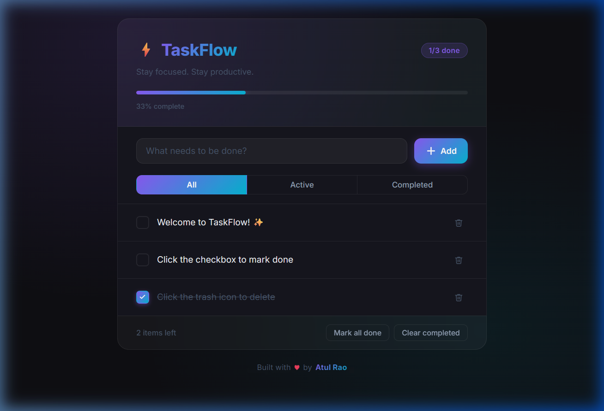
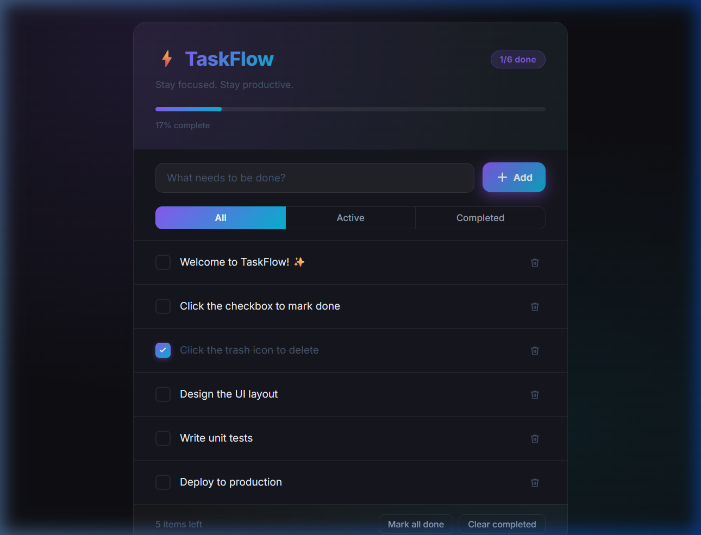
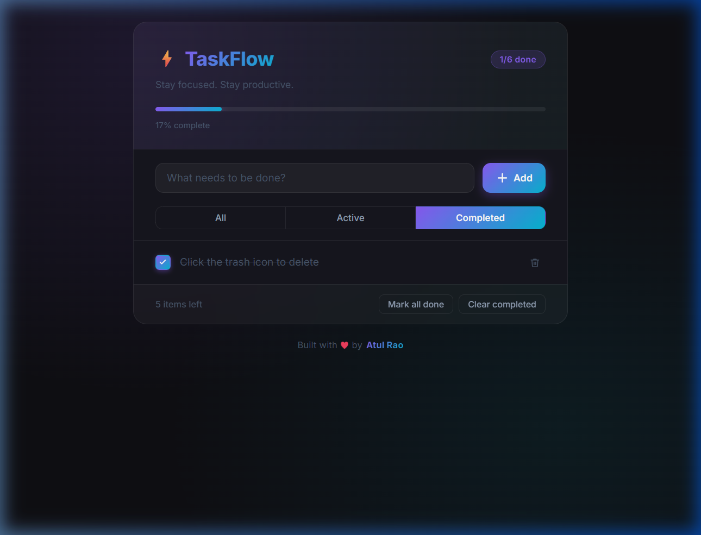
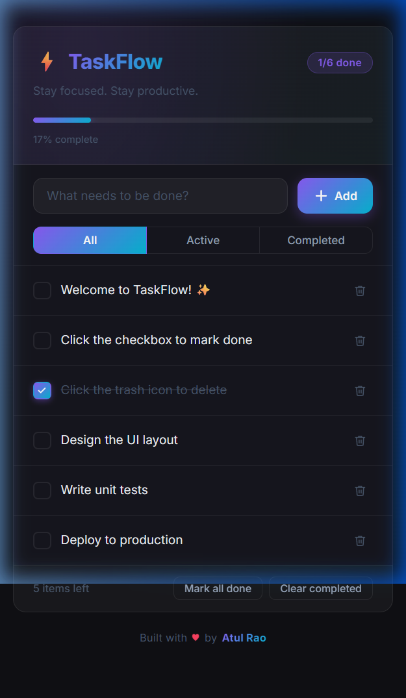

<div align="center">

# ⚡ TaskFlow

### A modern, glassmorphic task manager built with React + Vite

[](https://react.dev/)
[](https://vitejs.dev/)
[](https://developer.mozilla.org/en-US/docs/Web/CSS)
[](LICENSE)

*Stay focused. Stay productive.*

</div>

---

## 📸 Screenshots

<table>
  <tr>
    <td align="center">
      <strong>🏠 Default View</strong><br/>
      
    </td>
    <td align="center">
      <strong>📋 Multiple Tasks</strong><br/>
      
    </td>
  </tr>
  <tr>
    <td align="center">
      <strong>✅ Completed Filter</strong><br/>
      
    </td>
    <td align="center">
      <strong>📱 Mobile Responsive</strong><br/>
      
    </td>
  </tr>
</table>

---

## ✨ Features

| Feature | Description |
|--------|-------------|
| ➕ **Add Tasks** | Type and press `Enter` or click `+ Add` to create a new task |
| ✅ **Toggle Done** | Click the custom checkbox to mark a task as complete — with a smooth gradient animation |
| 🗑️ **Delete Tasks** | Remove individual tasks instantly with the trash icon |
| 🔍 **Smart Filters** | Switch between **All**, **Active**, and **Completed** views |
| 📊 **Progress Bar** | Animated glowing progress bar tracks overall completion percentage in real time |
| 📌 **Stats Badge** | Live `done / total` badge in the header |
| ✔️ **Mark All Done** | One-click button to complete all tasks at once |
| 🧹 **Clear Completed** | Bulk-remove all finished tasks instantly |
| ⚠️ **Error Validation** | Shake animation + red highlight when you try to add an empty task |
| 📱 **Fully Responsive** | Fluid layout across all screen sizes — from 360px phones to wide desktops |
| ♿ **Accessible** | Semantic HTML, ARIA labels, and keyboard-navigable throughout |

---

## 🎨 Design Highlights

> **Dark Glassmorphism UI** — a premium aesthetic built entirely with vanilla CSS

- 🌌 **Dark theme** with a rich blue-violet radial glow background
- 🪟 **Glassmorphic card** with `backdrop-filter: blur` and translucent borders
- 🎨 **Accent gradient** (`violet → cyan`) applied to logo, buttons, checkboxes, and progress bar
- 🌀 **Micro-animations** — fade-in on load, slide-in for new tasks, heartbeat on the ❤️ icon, shake on error
- 💫 **Hover states** with glowing shadows and smooth `transform` transitions
- 🧊 **Touch-friendly** — hover effects disabled on coarse pointer devices (mobile/tablet)

---

## 🛠️ Tech Stack

```
Frontend Framework : React 19 (with Hooks)
Build Tool         : Vite 6
Styling            : Vanilla CSS (Custom Properties, Flexbox, Animations)
Unique IDs         : uuid v4
Linting            : ESLint + react-hooks + react-refresh plugins
```

---

## 🚀 Getting Started

### Prerequisites

- [Node.js](https://nodejs.org/) v18 or higher
- npm (comes with Node.js)

### Installation & Running Locally

```bash
# 1. Clone the repository
git clone https://github.com/AtulRao22/TaskFlow.git

# 2. Navigate into the project directory
cd TaskFlow/todo-app

# 3. Install dependencies
npm install

# 4. Start the development server
npm run dev
```

Open your browser and visit **http://localhost:5173** 🎉

### Build for Production

```bash
npm run build
```

The optimised output will be in the `dist/` folder, ready for deployment.

### Preview Production Build

```bash
npm run preview
```

---

## 📁 Project Structure

```
todo-app/
├── public/                 # Static assets
├── src/
│   ├── App.jsx             # Root component (mounts TodoList)
│   ├── App.css             # Global app-level styles
│   ├── index.css           # CSS custom properties & body/layout styles
│   ├── TodoList.jsx        # Core app logic & UI
│   ├── TodoList.css        # Component-scoped styles (all glassmorphism)
│   └── main.jsx            # React DOM entry point
├── index.html              # HTML shell
├── vite.config.js          # Vite configuration
├── package.json            # Dependencies & scripts
└── screenshots/            # README preview images
```

---

## ⌨️ Keyboard Shortcuts

| Key | Action |
|-----|--------|
| `Enter` | Add the typed task |
| `Tab` | Navigate between interactive elements |
| `Space` | Toggle checkbox focus state |

---

## 📱 Responsive Breakpoints

| Breakpoint | Layout Adjustments |
|---|---|
| `> 600px` | Full desktop layout |
| `≤ 600px` | Reduced padding, tighter spacing |
| `≤ 480px` | Stacked input row (input + button go vertical) |
| `≤ 360px` | Compact font sizes and minimal padding |

---

## 🤝 Contributing

Contributions, issues, and feature requests are welcome!

1. **Fork** the repository
2. Create a feature branch: `git checkout -b feature/amazing-feature`
3. Commit your changes: `git commit -m 'feat: add amazing feature'`
4. Push to the branch: `git push origin feature/amazing-feature`
5. Open a **Pull Request** 🚀

---

## 📄 License

This project is licensed under the **MIT License** — see the [LICENSE](LICENSE) file for details.

---

<div align="center">

Built with ❤️ by **[Atul Rao](https://github.com/AtulRao22)**

*If you found this useful, consider giving it a ⭐ on GitHub!*

</div>
